## Things I made

### Demoscene productions:

I submitted some artwork for demoscene competitions. I was creating 4-kilobyte executables that render an image. The pictures below are all screenshots from the entries I submitted. The rendering is done with path tracing using only shader maths (no 3D assets).

- Ealy bird: Released at Nova 2023. 1st place. [[Image]](https://media.demozoo.org/screens/o/4d/ed/7c14.328232.jpg)[[Link]](https://demozoo.org/graphics/325420/){:target="_blank"}
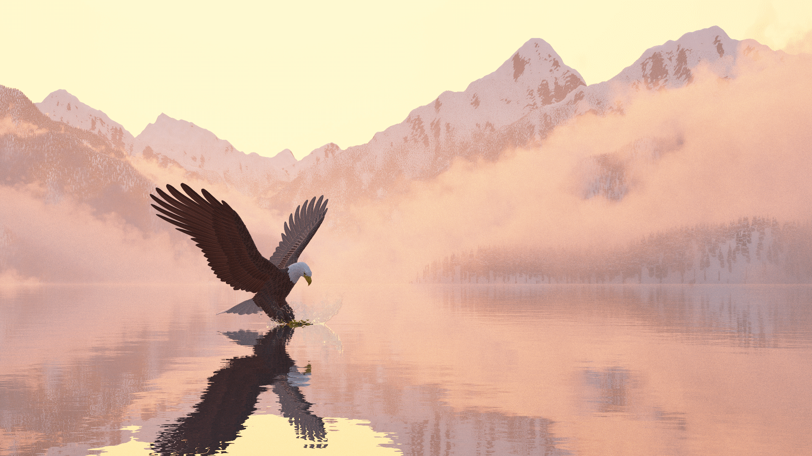

- Storm: Released at Revision 2023. 1st place. [[Image]](https://media.demozoo.org/screens/o/2e/8f/fa15.324439.png)[[Link]](https://demozoo.org/graphics/322479/){:target="_blank"}
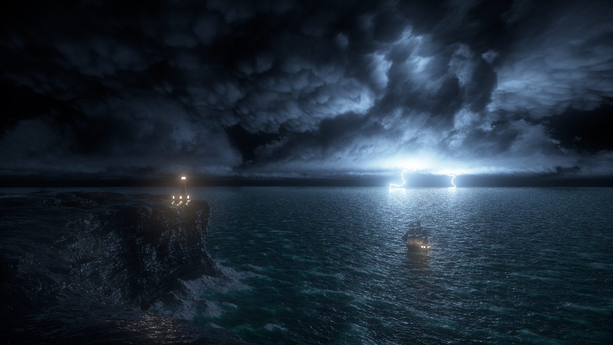

---
---
---

### Shadertoys:

I spend a lot of time making shaders on Shadertoy. Those are similar to tiny little rendering engines written inside a pixel shader.

- Tree in the wind [[Shader]](https://www.shadertoy.com/view/tdjyzz){:target="_blank"}[[Video]](https://youtu.be/laUxOCEbJUM){:target="_blank"}
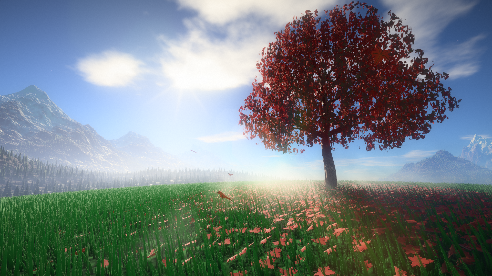

- The beach [[Shader]](https://www.shadertoy.com/view/3sy3Wy){:target="_blank"}[[Video]](https://youtu.be/c9yfQYf5SfY){:target="_blank"}
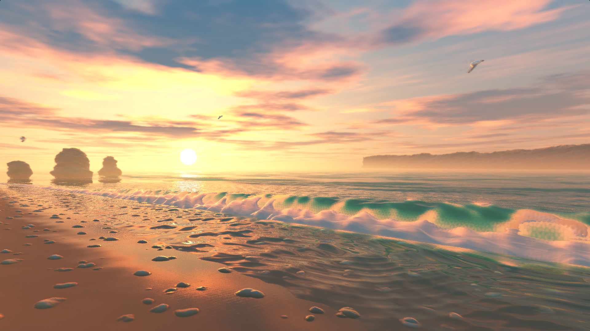

- Campfire at night [[Shader]](https://www.shadertoy.com/view/Wtc3W2){:target="_blank"}[[Video]](https://youtu.be/r8iq6GMLPIc){:target="_blank"}
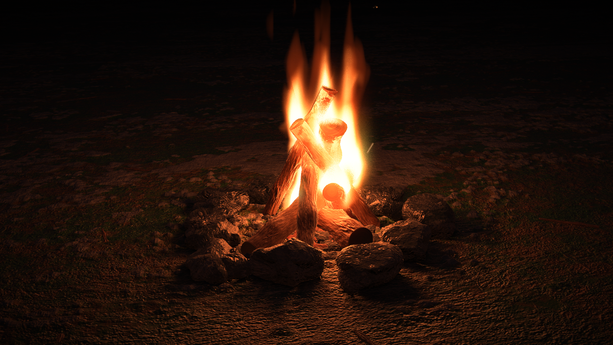

- Lightsaber duel [[Shader]](https://www.shadertoy.com/view/lsVXRh){:target="_blank"}[[Video]](https://youtu.be/gqOSqwkAKkI){:target="_blank"}

---
---
---

### (Some) Shipped games:

I was lucky to work on several shipped games.

- Star Wars : Squadrons | Graphics programmer
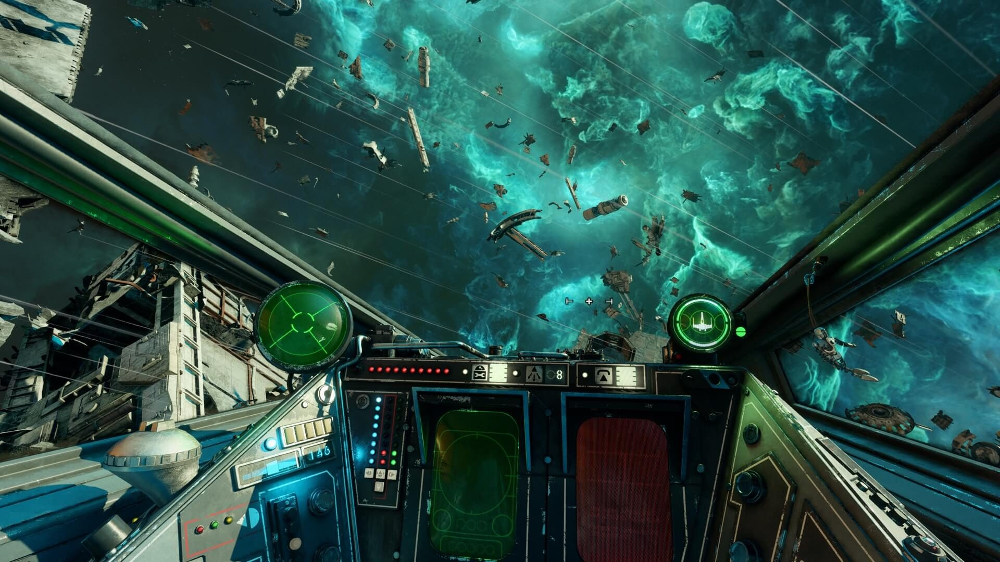

- Dirt 5 | Senior graphics programmer
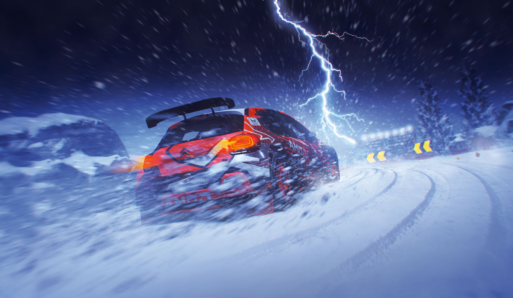

- Onrush | Graphics programmer
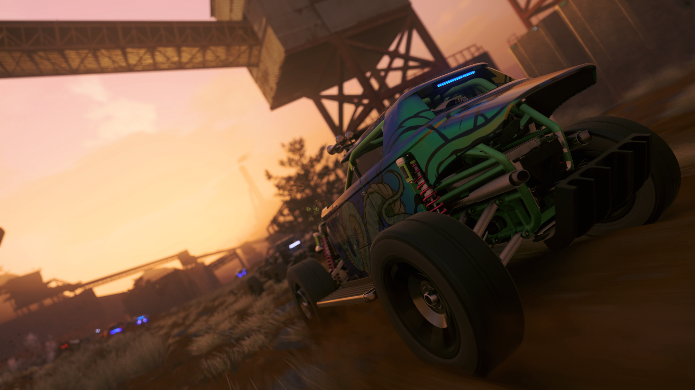

- Forza horizon 3 | Game programmer

---
---
---

### (Old) Personal projects:

We all have to start somewhere :). Those are some older personal projects I worked on when I was in university.

- Sand castle engine | Custom C++ engine [[Video]](https://www.youtube.com/watch?v=cFkd4efEQKk){:target="_blank"}
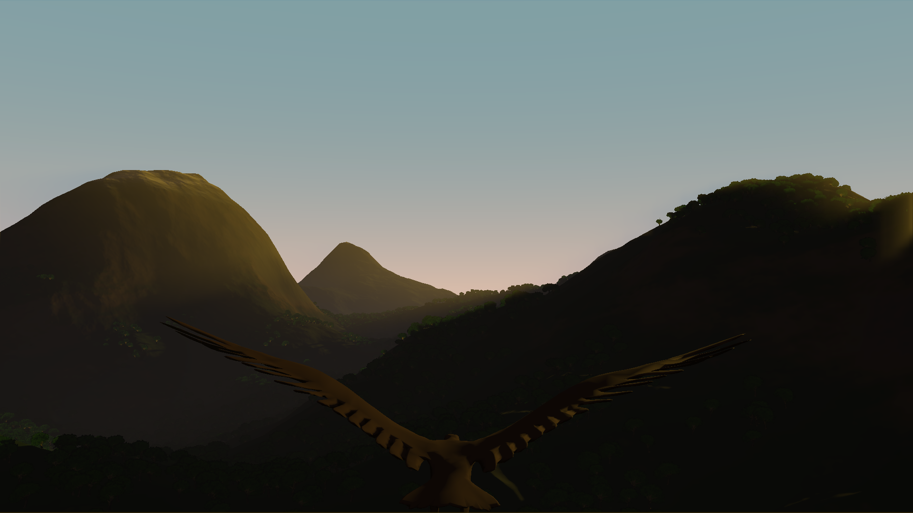

- Life of bob, a vampire story | Unity game [[Video]](https://www.youtube.com/watch?v=Q-TYjj33TH4){:target="_blank"}
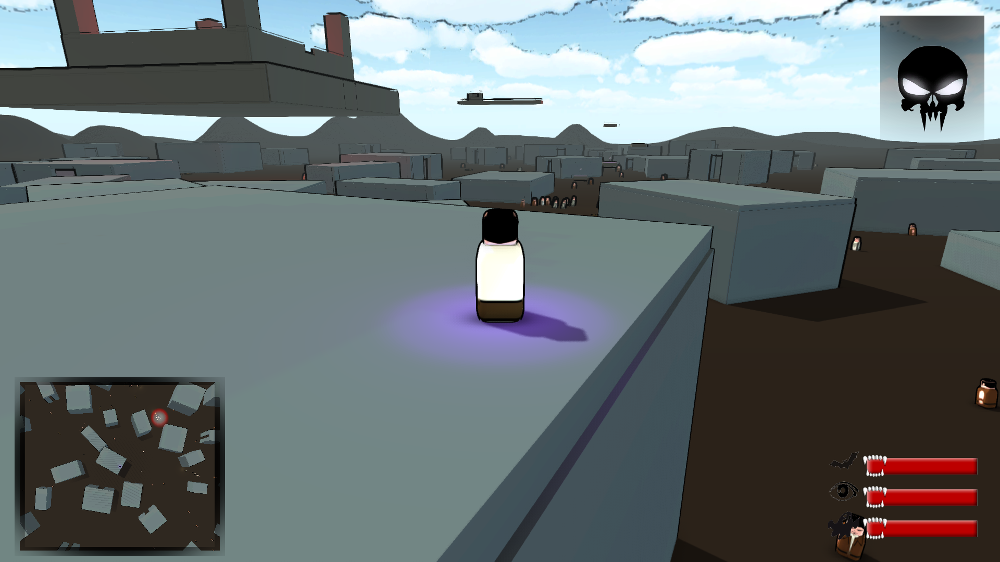

- Drunken ninja Vs Aliens | Game jam in Unity [[Video]](https://www.youtube.com/watch?v=_yHSVeH0XpM){:target="_blank"}
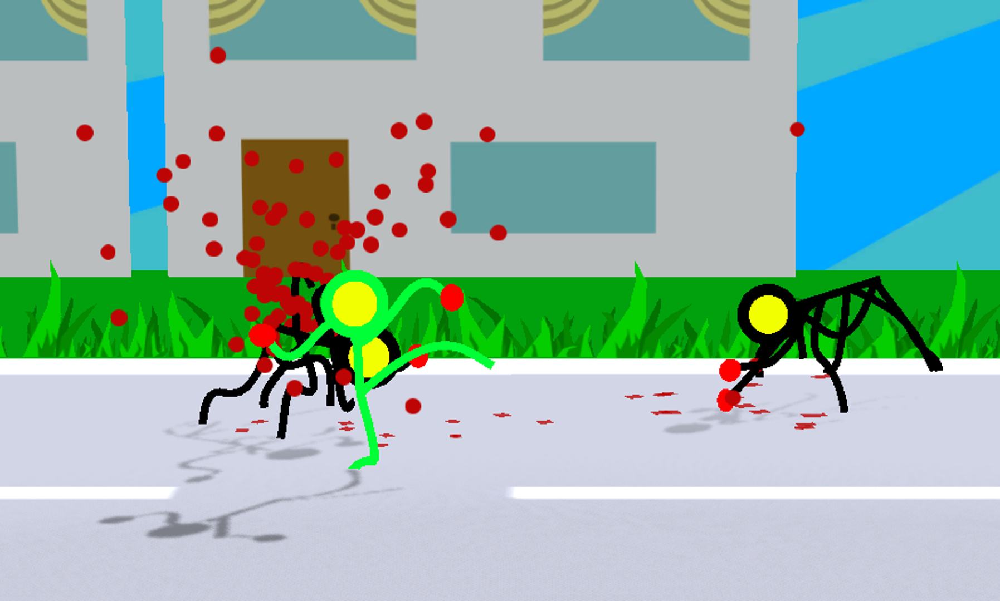

- Project sword | Java 2D fighting game [[Video]](https://www.youtube.com/watch?v=ZhxmPZplz6E){:target="_blank"}
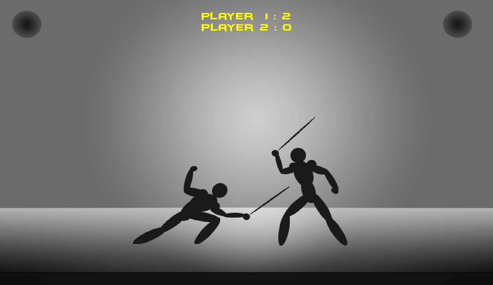

